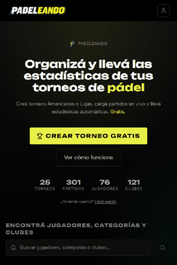

<div align="center">

# 🎾 Padeleando

**Plataforma web para organizar torneos de pádel: armá la jornada, cargá los resultados en vivo y compartí la tabla con un link.**

[**Ver la app en producción →**](https://padeleando.ar)

[](https://react.dev)
[](https://vite.dev)
[](https://tailwindcss.com)
[](https://expressjs.com)
[](https://neon.tech)
[](https://vercel.com)

</div>

---

## Qué es

Los torneos de pádel amateur se organizan en grupos de WhatsApp: alguien anota los resultados en una libreta, arma la tabla a mano y la manda como foto. Padeleando reemplaza eso.

Un organizador crea una **categoría** (su grupo recurrente), y dentro de ella una **jornada** por fecha jugada. Elige el formato — **Liga** (todos contra todos) o **Americano** (fase de grupos + llave eliminatoria) — y el modo — **jugadores libres** (las parejas rotan) o **parejas fijas**. Desde ahí carga los partidos en vivo, con cronómetro, mientras la tabla de posiciones se recalcula sola.

Todo lo público se comparte con un link, sin cuenta ni instalación: la jornada (`/view/:id`), la categoría (`/cat/:id`) y el perfil de cada jugador (`/u/:username`), con sus estadísticas históricas.

<div align="center">

</div>

<div align="center"><sub>Recorrido grabado sobre datos reales de producción: portada → jornada compartida (tabla, partidos, estadísticas, historia 9:16 para Instagram) → perfil del jugador.</sub></div>

---

## Funcionalidades

| | |
|---|---|
| 🏆 **Dos formatos** | Liga (round-robin con tabla) y Americano (fase regular + bracket eliminatorio con avance de ganadores) |
| 👥 **Dos modos** | Jugadores libres con parejas rotativas, o parejas fijas durante todo el torneo |
| ⏱️ **Partido en vivo** | Cronómetro corriendo, resultado editable y tabla que se recalcula en cada carga |
| 📊 **Estadísticas en tres capas** | Por jornada, históricas de la categoría (ranking, head-to-head, evolución del puesto) y perfil público del jugador (win rate, rachas, compañeros frecuentes, títulos) |
| 🔗 **Compartir sin cuenta** | Jornadas, categorías y perfiles públicos con tarjeta OG propia generada por una serverless function |
| ✉️ **Invitaciones** | Un jugador anotado a mano puede reclamar su slot: al aceptar, su nombre real reemplaza retroactivamente todo el historial |
| 🤝 **Co-organizadores** | Permisos en dos niveles (`is_owner` / `can_manage`) e invitación por `@usuario`, email o link, con transferencia de propiedad |
| ⭐ **Favoritos y avisos** | Seguí categorías públicas y recibí un aviso in-app cuando publican una jornada nueva |
| 🏟️ **Clubes** | Cada jornada puede jugarse en un club, con mapa, solicitudes de alta y foto propia en la tarjeta al compartirla |
| 💳 **Suscripciones reales** | Pasarela de pago con Mercado Pago en producción: planes mensual y anual, débito automático, cancelación al fin del período y webhooks — plan Free con cupos, Premium con fotos, avatar y estadísticas avanzadas |
| 🌓 **Tema claro/oscuro** | Oscuro por defecto, con variables CSS; PWA instalable |
| 🛠️ **Panel de admin** | Métricas del sitio, gestión de usuarios y de torneos para el rol `admin` |
| 🎮 **404 jugable** | La página de error es un frontón en canvas 2D, sin librerías |

---

## Arquitectura

Dos repositorios independientes, desplegados por separado:

```
                      ┌──────────────────────────────┐
   Navegador ───────► │  React SPA  (Vercel)         │
                      │  AuthContext · ThemeContext  │
                      │  React Router · Tailwind 4   │
                      └──────────────┬───────────────┘
                                     │  src/utils/api.js
                                     │  (cliente único, refresca el token en 401)
                                     ▼
                      ┌──────────────────────────────┐
                      │  API REST  (Render)          │
                      │  Express 5 · JWT · Bcrypt    │
                      └───┬────────────┬─────────┬───┘
                          ▼            ▼         ▼
                    Neon Postgres  Cloudinary  Resend
                     (sa-east-1)    (fotos)   (emails)
```

- **Frontend** → este repo · **Backend** → [`padeliando-api`](https://github.com/FabrizioCatanzaro/padeliando-api)
- **Auth**: access token JWT de 1 h + refresh token de 30 días en cookie `httpOnly`. Ningún token toca `localStorage`.
- **Autorización**: se resuelve en el servidor con guards (`requireTournamentManage`, `requireGroupManage`); el frontend sólo replica la regla para la UI.
- **Estado**: `AuthContext` para la sesión y el hook `useTournament` como única puerta a las operaciones de torneo (partidos, jugadores, parejas, bracket).
- **Normalización**: toda respuesta pasa por adaptadores (`adaptTournament`, `adaptMatch`, `adaptPair`) antes de llegar a un componente, así el resto del código nunca ve las formas crudas de la API.

Escala actual: ~26.000 líneas en 141 módulos del frontend y 71 del backend, sobre 18 tablas.

---

## Stack

**Frontend** — React 19 · React Router 7 · Vite 6 · Tailwind CSS 4 (plugin de Vite, sin `tailwind.config.js`) · Recharts (cargado con `React.lazy`) · Lucide · Leaflet · ESLint 9 flat config

**Backend** — Node + Express 5 · Neon serverless PostgreSQL · JWT · Bcrypt · Cloudinary · Resend (React Email) · Mercado Pago · Google OAuth

**Infra** — Vercel (SPA + serverless function para las tarjetas OG) · Render · Neon (São Paulo) · Vercel Analytics y Speed Insights

---

## Decisiones técnicas que vale la pena mirar

**Rendimiento medido, no supuesto.** Una auditoría llevó las cuatro rutas principales de **36–78 a 85–95** en Lighthouse mobile. Las causas reales: `await` encadenados sobre el driver HTTP de Neon (el perfil público pasó de ~11 round-trips serializados a 2 con `Promise.all`), imágenes de Cloudinary sin transformar que eran el 97% del peso móvil, Recharts (111 KB) importado estáticamente en rutas que ni lo mostraban, y estados de carga más cortos que el contenido real — eso solo costaba 0,7 de CLS. Todo se verifica contra el build de producción con `PerformanceObserver`, nunca contra el dev server.

**Estadísticas que no se contradicen entre sí.** Hay tres superficies (jornada, categoría, perfil) alimentadas por las mismas primitivas, dos calculadas en el cliente y una en SQL. Mantenerlas consistentes obligó a reglas explícitas: los partidos de la llave del Americano no viven en la tabla `matches` sino en un JSONB, así que todo conteo tiene que expandirlos; el historial se agrupa por identidad del jugador (`linked_username`) y no por `players.id`, porque cada jornada crea filas nuevas y los nombres se repiten; y el ranking por win rate va suavizado con un prior bayesiano, para que un 1-0 no le gane a un 18-4.

**Una estadística sin datos se envía oculta, no falsa.** Antes de construir cada métrica se midió su cobertura real en la base. Tres se calculan a cero a propósito y se encienden solas cuando aparezcan los datos: la de sets sólo cuenta partidos al mejor de tres (todavía no hay ninguno), la de palizas exige un 6-0 real (se descartó un umbral por diferencia de games que marcaba un 1-0 como paliza) y el ranking de seguidos necesita 2+ personas seguidas con partidos.

**El pádel no admite empates.** No es una validación de formulario: el formulario no deja guardarlo, la API rechaza `score1 === score2` y el cálculo de posiciones descarta las filas iguales que quedaron de versiones viejas en lugar de adjudicárselas a alguien.

**Cobros recurrentes que no dependen de que llegue el webhook.** La suscripción se implementa con *preapprovals* de Mercado Pago (débito automático, mensual o anual). El problema del enfoque ingenuo es que el estado premium queda atado a atrapar cada webhook de cobro: si la API está dormida o devuelve un 503, ese evento se pierde y el usuario amanece sin premium habiendo pagado. Acá el estado se **reconcilia contra Mercado Pago**: cuando la fecha de fin está por vencer, se consulta el preapproval y, si sigue `authorized`, se empuja hasta la próxima fecha de cobro; si volvió `cancelled` o `paused`, se expira. El webhook sigue existiendo, pero es un atajo, no la única fuente de verdad.

Alrededor de eso van los detalles que sólo aparecen con tráfico real: la vinculación se resuelve por el `preapproval_id` que MP agrega al `back_url` más la sesión, y no por email — el preapproval no expone el email del pagador y asumir que coincide con el de la cuenta rompe con cualquiera que pague con otra; cancelar marca `cancel_at_period_end` en lugar de cortar el acceso al instante, porque el período ya está pagado; y un mismo preapproval no puede quedar vinculado a dos usuarios.

**Bajar de Premium a Free no rompe nada.** El cupo se compara contra el total actual, así que quien creó 5 categorías con Premium las conserva funcionando y sólo pierde la posibilidad de crear una sexta. Las fotos ya subidas siguen públicas.

---

## Estructura

```
src/
├── components/
│   ├── shared/       # Primitivas reutilizables (Modal, Header, PlayerAvatar, AlertStack…)
│   ├── Home/         # Portada del visitante y dashboard del usuario
│   ├── Auth/         # Login, registro, perfil público, verificación, reset
│   ├── Setup/        # Wizard de creación: formato → jugadores → parejas
│   ├── Main/         # Hub de la jornada con pestañas
│   ├── Matches/      # Lista, alta y edición de partidos; partido en vivo
│   ├── Standings/    # Tabla de posiciones
│   ├── Stats/        # Estadísticas de la jornada y de la categoría
│   ├── Americano/    # Bracket eliminatorio y previa
│   ├── Management/   # Gestión de jugadores, parejas y cierre del torneo
│   ├── Photos/       # Galería (Premium)
│   ├── Club/         # Clubes: ficha, mapa y solicitudes de alta
│   ├── Subscription/ # Checkout y gestión del plan (Mercado Pago)
│   ├── Admin/        # Panel de administración
│   └── ReadonlyView/ # Vista pública compartible
├── context/          # AuthContext, ThemeContext, AlertContext
├── hooks/            # useTournament — todas las operaciones de torneo
└── utils/            # api.js (cliente único), helpers.js (adaptadores y standings), plan.js
```

El mapa completo de componentes, rutas, endpoints y esquema de base está en [`project-structure.md`](project-structure.md).

---

## Licencia

© 2026 Fabrizio Catanzaro. Todos los derechos reservados.

El código es público para consulta y evaluación. No se otorga permiso para usarlo, copiarlo, modificarlo ni redistribuirlo, total o parcialmente, sin autorización escrita.

Padeleando es un producto en producción, no una plantilla: el repositorio está abierto para mostrar cómo está construido.

---

## Autor

**Fabrizio Catanzaro** — [GitHub](https://github.com/FabrizioCatanzaro) · [padeleando.ar](https://padeleando.ar)
